# Incident to RCE: Chaining a Format String Leak and an Off-by-One

This repository documents a controlled TCP server incident from initial network evidence to remote code execution and remediation.

The investigation combines:

- PCAP and stream reconstruction
- C source review and GDB validation
- format-string stack disclosure
- an off-by-one stack corruption
- partial pointer overwrite and return-address control
- 32-bit x86 shellcode analysis
- Python exploit construction
- corrective code and hardening recommendations

## Executive summary

The server exposed an `ECHO` command that passed attacker-controlled input as a `printf` format string. Repeated probes disclosed stack values and helped calibrate the connection-specific memory layout.

The same service copied a message into a 200-byte stack buffer with an inclusive loop bound. A 200-byte input therefore performed a 201st write. The byte written at the boundary modified the adjacent loop counter, allowing later bytes to overwrite control variables and redirect the write pointer toward the saved return address.

With executable stack protections disabled in the tested configuration, the overwritten return address landed in a NOP sled followed by x86 shellcode. The shellcode duplicated the socket descriptor over standard streams and executed `/bin/sh`.

```mermaid
flowchart LR
    A[PCAP evidence] --> B[Format-string probes]
    B --> C[Stack disclosure and calibration]
    C --> D[200-byte boundary]
    D --> E[Off-by-one overwrites i]
    E --> F[Corrupt len and dst]
    F --> G[Overwrite saved RET]
    G --> H[NOP sled and x86 shellcode]
    H --> I[Remote shell]
    I --> J[Remediation and hardening]
```



## What was tested

The full exploit chain was tested end to end in the original controlled environment. The recorded run shows the leak, payload delivery, interactive shell, and command execution on the target service.

The public repository is a cleaned publication of that work. Its payload builder, evidence, source excerpts, and claims are checked statically against the original code, traces, and logs. 

## Repository map

| Path | Purpose |
| --- | --- |
| `docs/incident-reconstruction.md` | Network chronology and post-exploitation evidence |
| `docs/exploitation-chain.md` | Stack layout, offsets, shellcode, and payload construction |
| `docs/remediation.md` | Root causes, robust fixes, and defense in depth |
| `exploit/exploit.py` | Standard-library Python reproduction script and dry-run builder |
| `snippets/` | Minimal vulnerable and corrected C excerpts |
| `evidence/` | Sanitized logs, GDB observations, and payload map |
| `tests/` | Offline tests for parsing, calibration, and payload layout |

## Run the offline payload check

```bash
python3 exploit/exploit.py --dry-run --leak 0xff805395
python3 -m unittest discover -s tests -v
```

The live mode targets only an explicitly supplied controlled service:

```bash
python3 exploit/exploit.py --host 192.0.2.10 --port 6000
```

